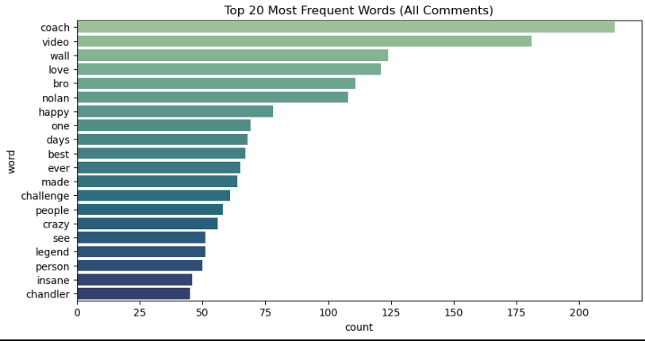
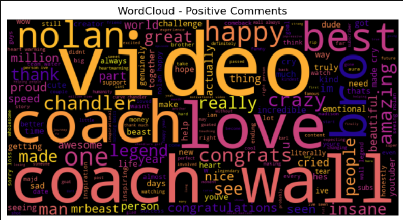
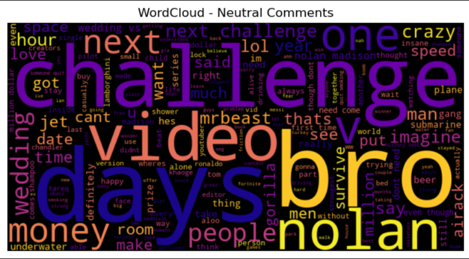
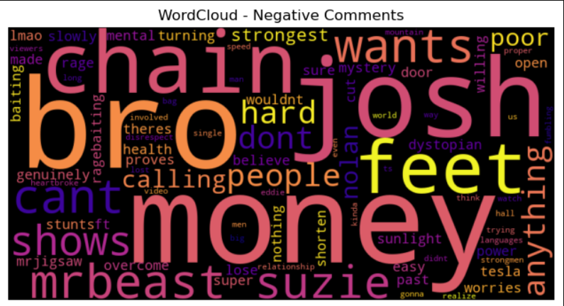
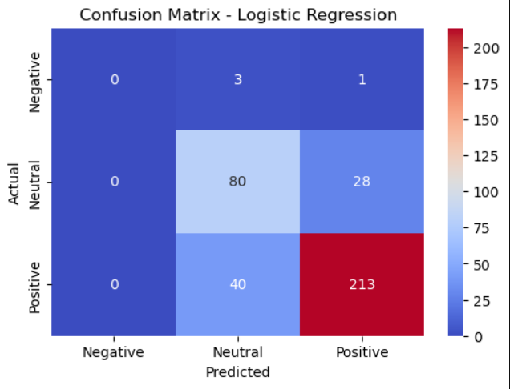
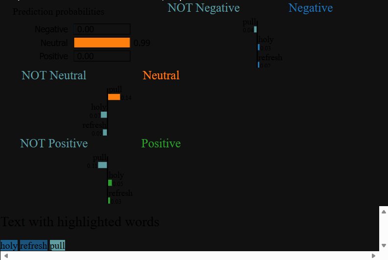

# 🎬 YouTube Comment Sentiment Analysis — MrBeast Edition 🎥  

> _"Every video tells a story. Every comment reveals the emotion behind it."_ 💬  
> _— Turning raw audience voice into data-driven insight through NLP & Deep Learning_

---

## 🌍 Project Overview

In the age of content, audience sentiment defines success.  
This project dives into **MrBeast’s YouTube comments**, decoding how millions of viewers feel — excitement, curiosity, or criticism — using the power of **Natural Language Processing (NLP)** and **Explainable AI (XAI)**.

Through a combination of **data cleaning, linguistic analysis, machine learning, and neural networks**, this project transforms unstructured YouTube comments into **interpretable emotional insights**.

---

## 🎯 Problem Statement

How can we automatically understand what millions of YouTube viewers are feeling?

With thousands of comments per video, it’s impossible for humans to read them all.  
By applying sentiment analysis, we can:  
- Quantify audience satisfaction & engagement  
- Detect negative or toxic feedback early  
- Optimize content strategy based on audience emotion  

---

## 💡 Objectives

1. **Preprocess and clean** unstructured YouTube comment text.  
2. Perform **Exploratory Text Analysis (EDA)** to visualize audience tone and patterns.  
3. Develop baseline and advanced **Machine Learning and Deep Learning models**.  
4. Implement **Explainable AI** to interpret why the model predicts a given sentiment.  
5. Present a visually appealing and interpretable story from data.

---

## 🧠 Workflow

| Step | Description |
|------|--------------|
| **1. Data Acquisition** | Gathered 6,800+ real comments from MrBeast’s YouTube videos. |
| **2. Preprocessing** | Removed noise, duplicates, emojis, and stopwords. Reduced to 1,822 high-quality unique comments. |
| **3. EDA** | Explored word patterns, frequencies, and sentiment distributions. |
| **4. Feature Engineering** | Used TF-IDF and padded token sequences for NLP models. |
| **5. Modeling** | Compared Logistic Regression, XGBoost, and a Bi-LSTM neural network. |
| **6. Explainability** | Applied **LIME** to visualize which words drive predictions. |
| **7. Visualization & Export** | Created sentiment charts, word clouds, and a processed CSV for reproducibility. |

---

## 📊 Key Visuals

| Insight | Visualization |
|----------|----------------|
| **Top 20 Frequent Words** |  |
| **Positive WordCloud** |  |
| **Neutral WordCloud** |  |
| **Negative WordCloud** |  |
| **Confusion Matrix (Bi-LSTM)** |  |
| **Explainable AI (LIME)** |  |

---

## 🧩 Model Performance

| Model | Technique | Accuracy | Comments |
|--------|------------|-----------|-----------|
| Logistic Regression | TF-IDF baseline | 80.2% | Solid starter model |
| Random Forest + XGBoost Ensemble | Boosting + Voting | 80.0% | Stable, but data-limited |
| **Bi-LSTM (Deep Learning)** | Context learning + word embeddings | **85.8%** | Best performance |

---

## 💬 Interpretability (LIME Insights)

> LIME highlights which words influenced each prediction.  
> For example,  
> - Words like **“love”, “awesome”, “best”** → push sentiment to **Positive**  
> - Words like **“weird”, “boring”** → lean toward **Neutral/Negative**

This makes the model **transparent and trustworthy**, not a black box.

---

## 🔍 Business Insights

- MrBeast’s audience is **overwhelmingly positive** (~69%).  
- **Neutral comments** often describe challenge details or facts.  
- **Negative sentiment** is rare (<2%) — showing exceptional brand love.  
- **High engagement vocabulary**: _“challenge”, “coach”, “best”, “win”, “amazing”_ → directly linked with enthusiasm.  

🧠 *Insight:* Such analysis can help creators and brands measure emotional reach, track reputation, and tune their messaging for audience connection.

---

## ⚙️ Tech Stack

| Category | Tools |
|-----------|-------|
| **Language** | Python 🐍 |
| **Data Processing** | pandas, numpy |
| **NLP** | nltk, scikit-learn, TensorFlow, keras |
| **Explainability** | LIME (Local Interpretable Model-Agnostic Explanations) |
| **Visualization** | matplotlib, seaborn, wordcloud |
| **Models** | Logistic Regression, Random Forest, XGBoost, Bi-LSTM |

---

## 🧾 Requirements

Install all dependencies:
```bash
pip install -r requirements.txt
```

**requirements.txt**
```
pandas
numpy
nltk
matplotlib
seaborn
scikit-learn
xgboost
tensorflow
lime
wordcloud
```

---

## 🧪 Reproducibility

**Processed Dataset:**  
📂 `data/processed_mrbeast_comments.csv` — cleaned, normalized text data.  

**Generated Visuals:**  
📸 WordClouds for each sentiment class:  
- `assets/wordcloud_positive.png`  
- `assets/wordcloud_neutral.png`  
- `assets/wordcloud_negative.png`

---

## 🧩 Future Enhancements

🔹 Integrate **Transformer-based models (BERT/RoBERTa)** for better contextual accuracy.  
🔹 Add **multilingual support** for non-English comments.  
🔹 Deploy as a **Streamlit Dashboard** where users input any YouTube link to analyze sentiment in real time.  

---

## ✨ Key Takeaways

- Data cleaning and EDA are as crucial as modeling.  
- Deep learning adds nuance to emotion understanding.  
- Explainability (XAI) builds trust and interpretability.  
- Visualization transforms insights into stories.  

> _"The best models don’t just predict — they explain, inspire, and connect."_ ❤️  

---

## 🧑‍💻 Author

**Naman Bansal**  
💼 Data Science & Machine Learning Enthusiast  
📫 [LinkedIn](#https://www.linkedin.com/in/naman-bansal-01969a325) 

---

⭐ _If this project inspired you, drop a ⭐ on the repository — it keeps the creativity flowing!_ ⭐
